# NexusOps

**Service Desk & IT Operations Platform** - A modular monolith built with Java 21, Spring Boot 3, Angular 17+, and cloud-native technologies.

## Highlights

- **Analyst console**: tickets by *my queues*, *assigned to me*, *unassigned* or the whole operation, with queue filters, ticket context (queue, topic, area, requester, form answers), queue moves, assignment by queue members and public replies or internal notes.
- **Requester portal**: a separate experience, not a trimmed console. Requesters pick a topic from the service catalog, fill a versioned dynamic form, attach evidence and follow progress in plain language. They never see queues, priorities or SLA.
- **Service flow** ([ADR-013](docs/adr/ADR-013-service-flow.md)): state machine with reopen cycles, SLA per cycle with pause and resume, append-only timeline, routing rules with a simulator, evidence with type and size validation.
- **Administration**: users, queues and members, catalog and forms, routing rules, roles and permissions, feature flags, settings and audit trail.
- **Security**: JWT auth, role- and permission-based menus and APIs, two-step verification (TOTP) with recovery codes.
- **Light by default, dark on demand**: a theme toggle sits at the top of every screen.

## Screenshots

The captures below use demo data (fictional people, queues and tickets).

### Analyst console

| | |
|---|---|
| 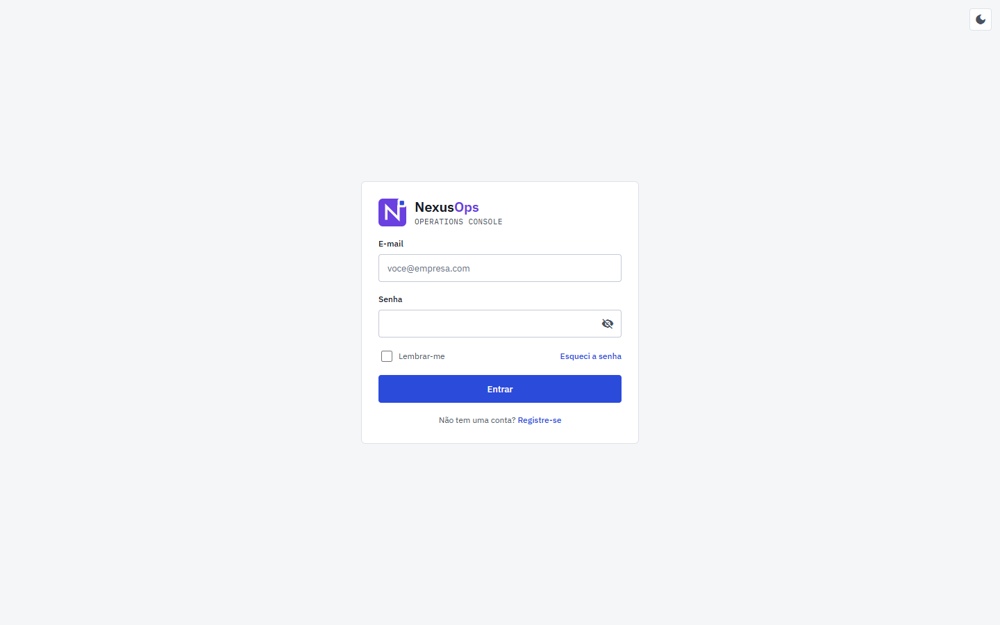 **Sign in** | 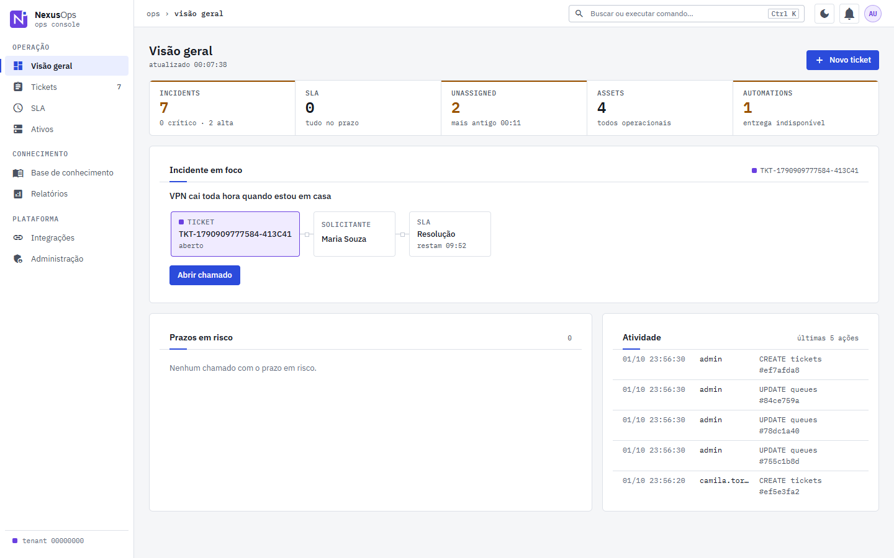 **Overview**: live indicators, focus incident and SLA at risk |
| 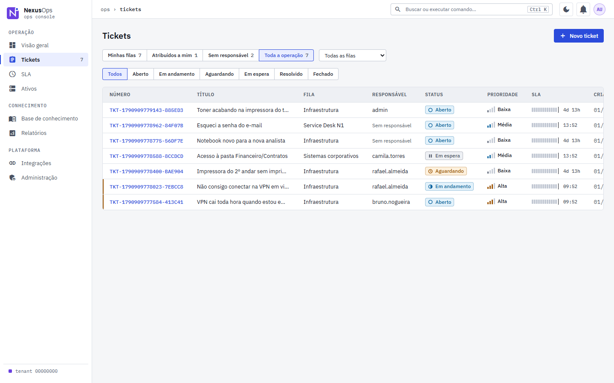 **Tickets** by scope, queue and status | 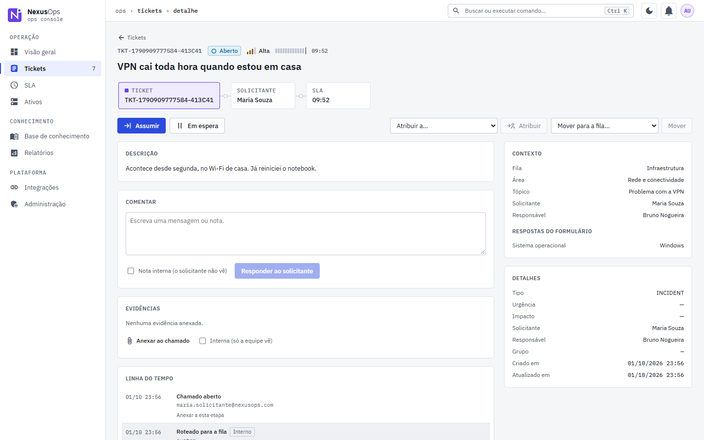 **Ticket detail**: context, actions, reply and timeline |
| 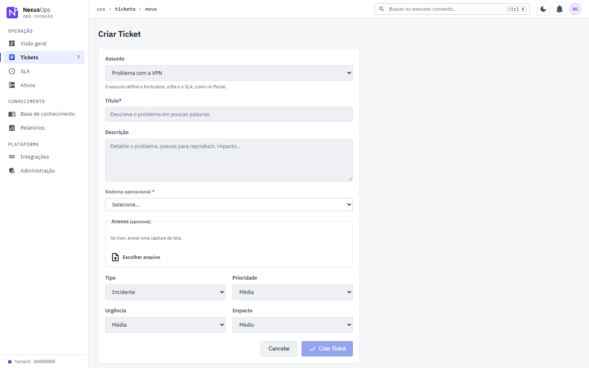 **New ticket** from a catalog topic with its dynamic form | 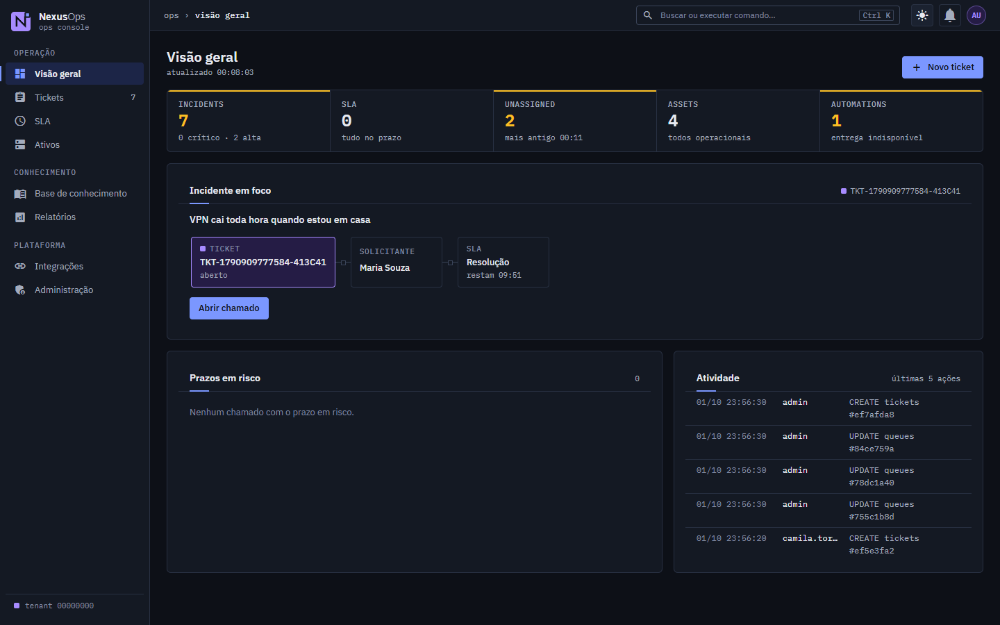 **Dark theme** |

### Requester portal

| | |
|---|---|
| 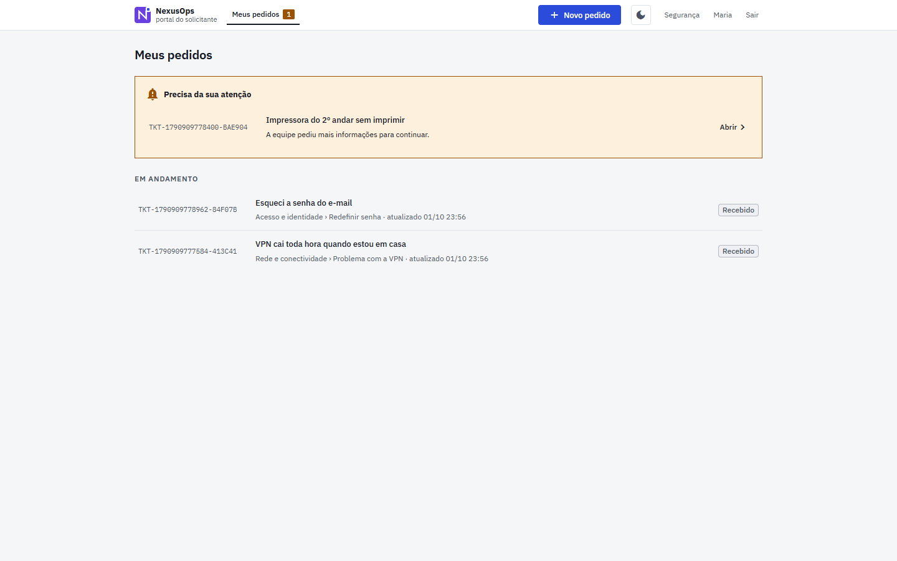 **My requests** in plain language | 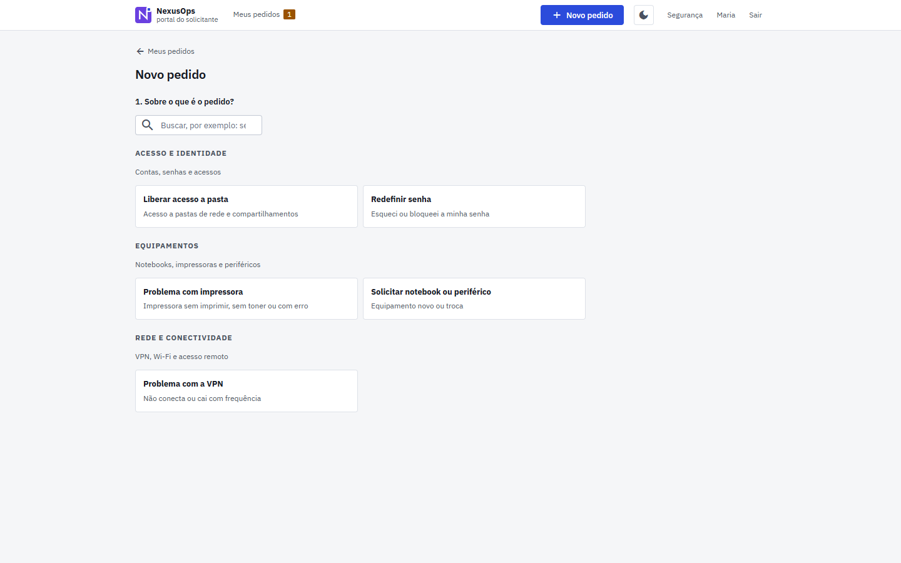 **New request**: pick a topic from the catalog |

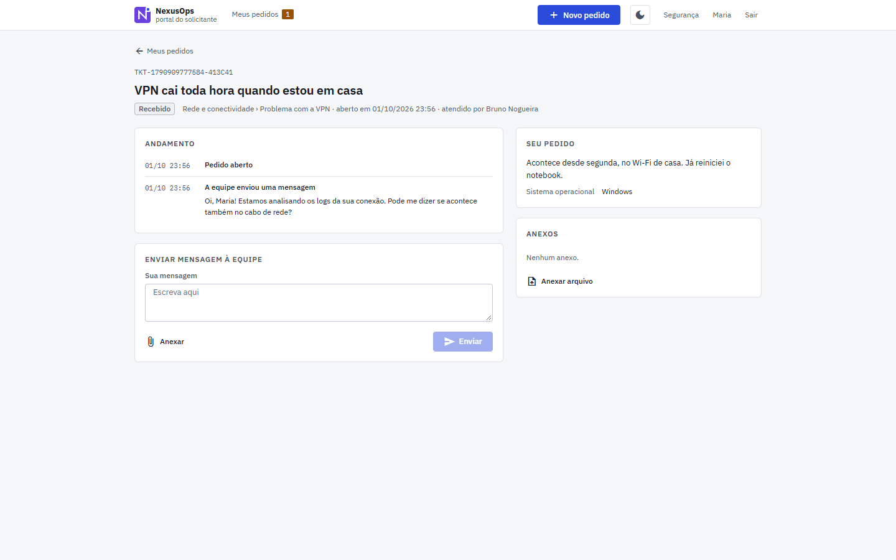
**Request detail**: public progress, the team's message and a reply box

### Administration

| | |
|---|---|
| 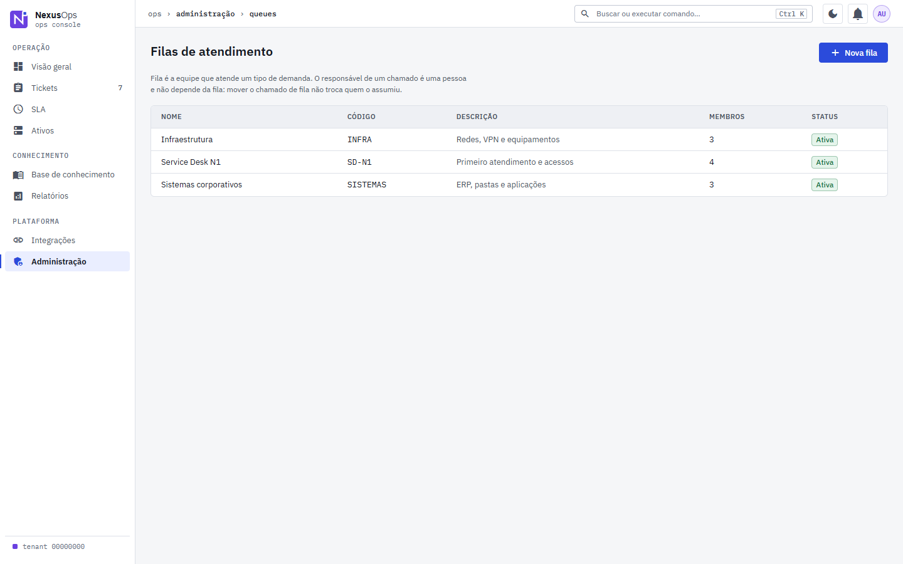 **Queues** and members | 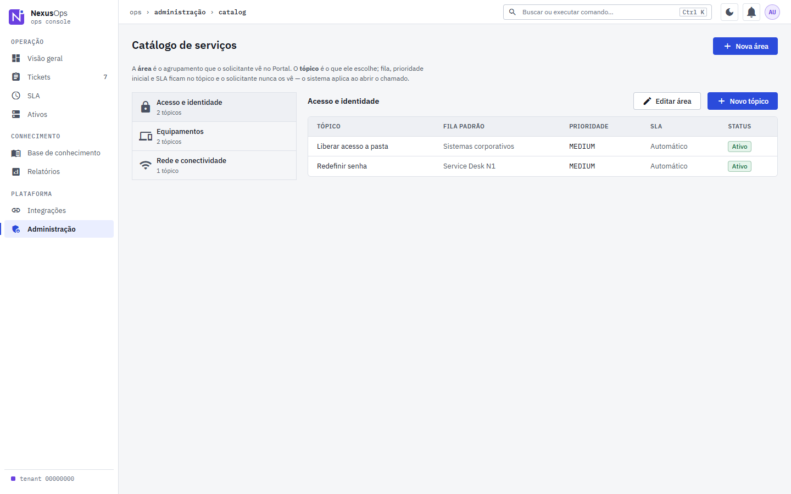 **Service catalog**: areas, topics, default queue and priority |
| 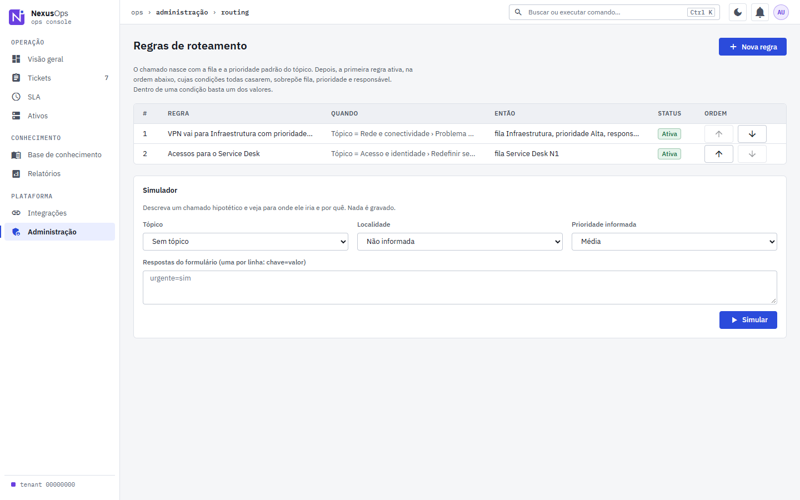 **Routing rules** with a simulator | 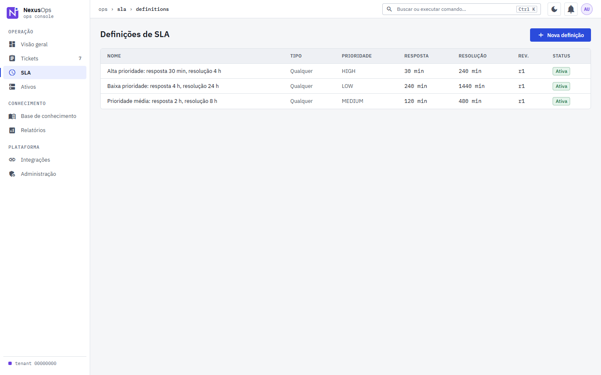 **SLA definitions** |
| 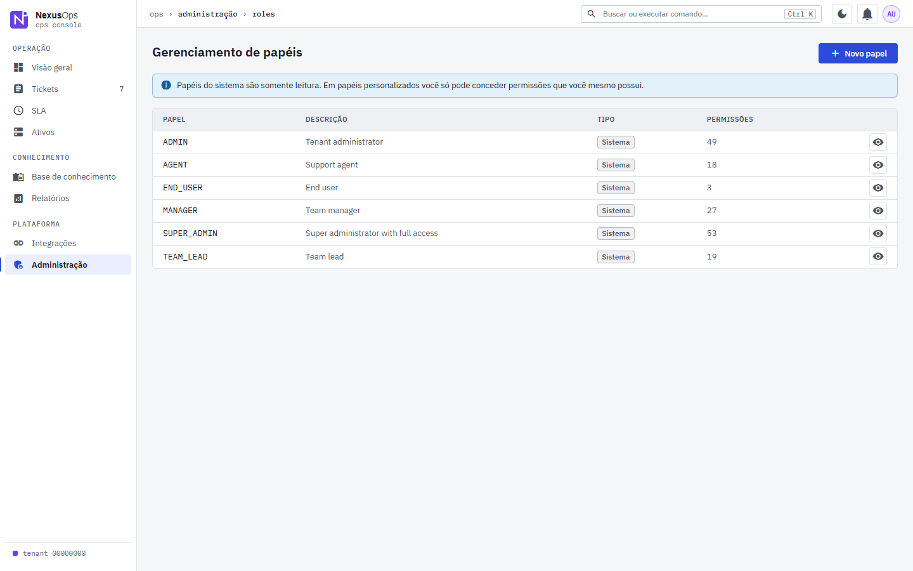 **Roles and permissions** | 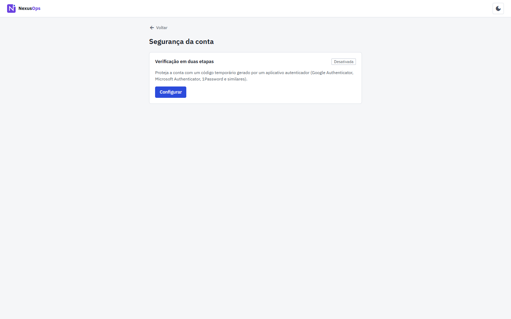 **Account security**: two-step verification |

## Tech Stack

| Layer | Technology |
|-------|------------|
| **Frontend** | Angular 17+, TypeScript, Angular Material 3, RxJS 7, Signals |
| **Backend** | Java 21, Spring Boot 3.2+, Spring Modulith, Spring Security, Spring Data JPA |
| **Database** | PostgreSQL 16, Redis 7, Flyway |
| **Auth** | JWT RS256, Embedded Spring Authorization Server (OAuth 2.1/OIDC), MFA TOTP |
| **API** | REST (OpenAPI 3.1), WebSocket (STOMP), SSE |
| **Infrastructure** | Docker, Kubernetes (Kustomize), ArgoCD, Terraform, AWS (EKS, RDS, ElastiCache) |
| **CI/CD** | GitHub Actions, Trivy, CodeQL, Cosign, Dependabot |
| **Observability** | OpenTelemetry, Prometheus, Grafana, Loki, Tempo, Pyroscope |
| **Testing** | JUnit 5, Mockito, Testcontainers, Spring Cloud Contract, Playwright, k6 |

## Architecture

- **Style**: Modular Monolith (Spring Modulith) - extraction-ready for microservices
- **Modules**: 10 bounded contexts (IAM, Ticketing, Asset, Knowledge, SLA, Notification, Reporting, Integration, Platform, Shared Kernel)
- **Communication**: Domain events (TransactionalEventPublisher) for cross-module async
- **Multi-tenancy**: Logical schemas + Hibernate Filters + TenantContext from JWT
- **Real-time**: WebSocket (STOMP) primary + SSE fallback

## Quick Start

### Prerequisites
- Java 21 (Temurin/Eclipse Temurin)
- Node.js 20+ (pnpm)
- Docker & Docker Compose
- Maven 3.9+ (or use wrapper)

### Local Development

```bash
# 1. Start infrastructure
cd ci-cd/docker
docker compose -f docker-compose.yml -f docker-compose.dev.yml up -d

# 2. Backend
cd ../../backend
./mvnw spring-boot:run -Dspring.profiles.active=dev

# 3. Frontend (new terminal)
cd ../frontend
pnpm install
pnpm run start
```

**Access**: http://localhost:4200 (UI) | http://localhost:8080/api/v1 (API) | http://localhost:8080/swagger-ui.html (OpenAPI)

## Project Structure

```
nexusops/
├── backend/                 # Spring Boot modular monolith
│   ├── nexusops-shared-kernel/
│   ├── nexusops-iam/
│   ├── nexusops-platform/
│   ├── nexusops-ticketing/
│   ├── nexusops-asset/
│   ├── nexusops-knowledge/
│   ├── nexusops-sla/
│   ├── nexusops-notification/
│   ├── nexusops-reporting/
│   ├── nexusops-integration/
│   └── nexusops-bootstrap/
├── frontend/                # Angular 17+ application
├── k8s/                     # Kubernetes manifests (Kustomize)
├── infrastructure/          # Terraform modules
├── ci-cd/                   # Docker, GitHub Actions
├── docs/                    # Architecture Decision Records
└── tests/                   # Performance, contract, e2e tests
```

## Documentation

- [Architecture Decisions (ADRs)](docs/adr/)
- [Directory Structure](docs/02-directory-structure.md)
- [Backend Modules](docs/03-backend-modules.md)
- [API Design](docs/04-api-design.md)
- [Database Design](docs/05-database-design.md)
- [Auth & Security](docs/06-auth-security.md)
- [Testing Strategy](docs/07-testing-strategy.md)
- [Docker & Compose](docs/08-docker-compose.md)
- [CI/CD](docs/09-ci-cd.md)
- [Kubernetes](docs/10-kubernetes.md)
- [AWS Infrastructure](docs/11-aws-infrastructure.md)
- [Observability](docs/12-observability.md)
- [Security](docs/13-security.md)
- [Phased Implementation](docs/14-phased-implementation.md)

## Contributing

See [CONTRIBUTING.md](CONTRIBUTING.md) for development workflow, coding standards, and quality gates.

## License

Apache 2.0 - See [LICENSE](LICENSE)